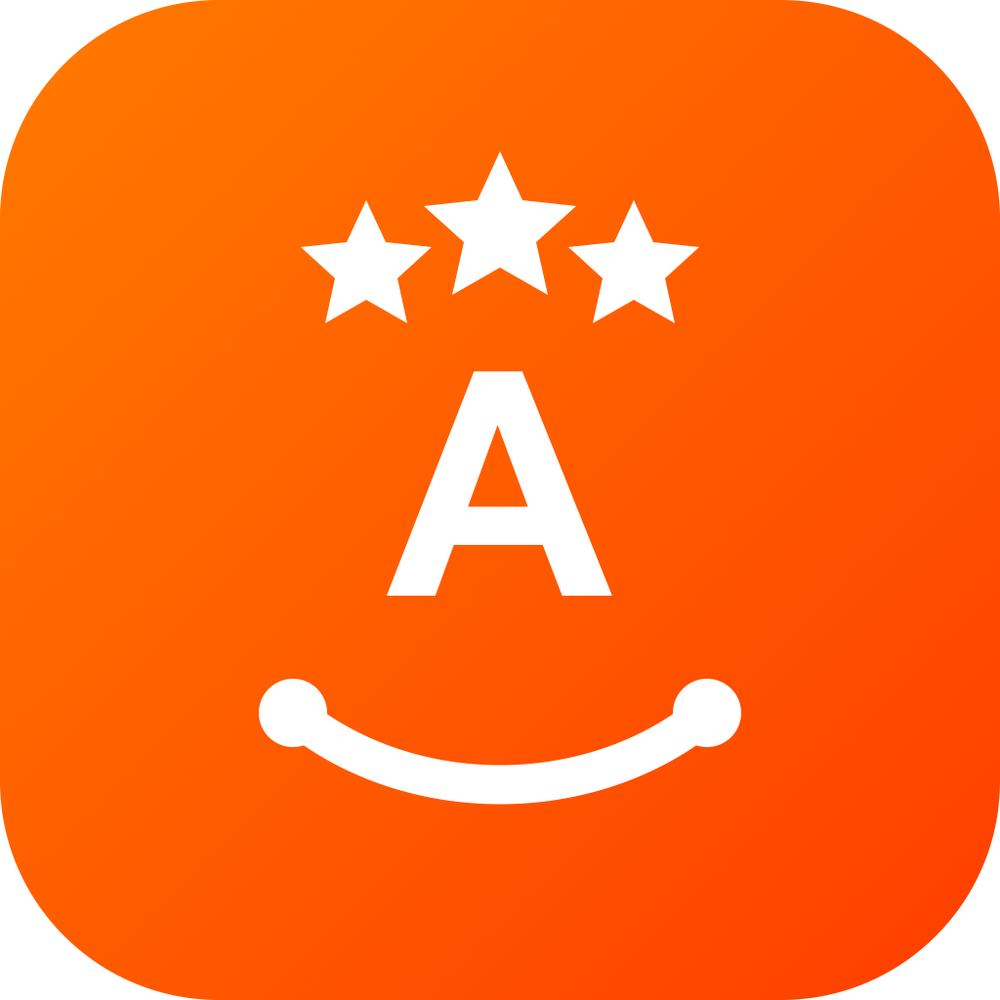

# Le Carré Connect — Front-office

<p align="center">
  
</p>

Application Android de l'Association Aurore destinée aux bénéficiaires.

## Télécharger l'APK

[Télécharger la dernière version Android](https://github.com/ApexXploit/Association-Aurore-Front-Office/releases/latest/download/Le-Carre-Connect-v2.1.4.apk)

L'APK s'installe directement sur Android. Il ne nécessite pas Expo Go.

## Fonctions principales

- accueil multilingue et création de compte ;
- assistant vocal et traduction ;
- démarches administratives guidées ;
- urgences et transports de proximité ;
- activités, carte, messagerie et profil ;
- vérification des mises à jour via les Releases GitHub.

## Développement

```bash
npm install
npx expo start --clear
```

Le projet utilise Expo SDK 54 et fonctionne avec Expo Go 54 pour les tests.

## Validation Android

```bash
npx expo export --platform android
```

Consultez `MISES_A_JOUR.md` pour publier une nouvelle version Android.
